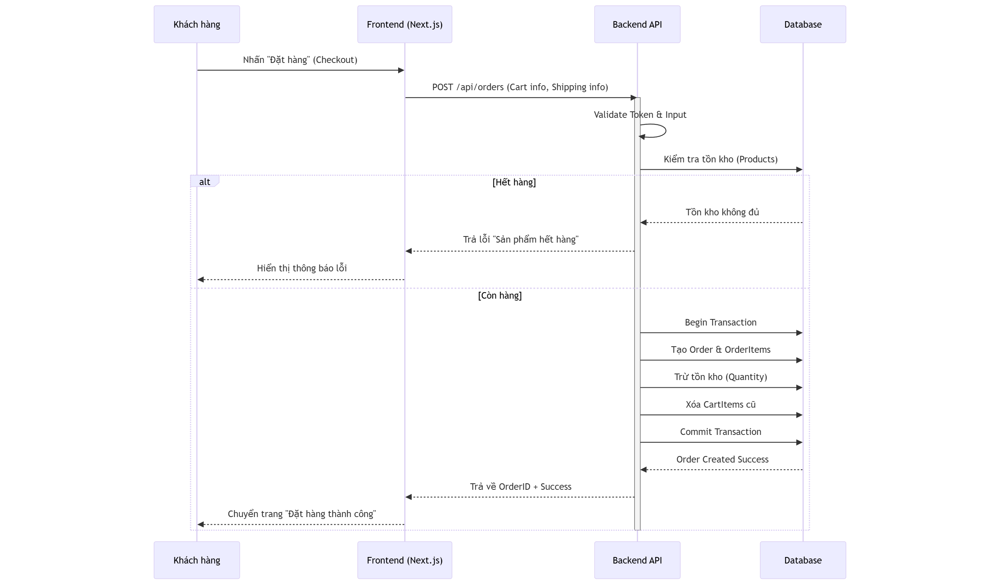

# SOFTWARE ARCHITECTURE DOCUMENT (SAD)
**Project:** BookStation
**Version:** 1.0
**Status:** Released

## 1. TỔNG QUAN KIẾN TRÚC (ARCHITECTURE OVERVIEW)
Hệ thống BookStation được xây dựng theo mô hình **Client-Server**, tách biệt giữa Frontend và Backend (Headless Architecture).

### 1.1 Tech Stack
* **Frontend:** Next.js (App Router), TypeScript, Tailwind CSS, Zustand, TanStack Query.
* **Backend:** ASP.NET Core Web API (.NET 8), Entity Framework Core (Npgsql).
* **Database:** PostgreSQL (Dockerized).
* **Tools:** Docker, Git (Gitflow), Visual Studio / VS Code.

## 2. CẤU TRÚC DỰ ÁN (PROJECT STRUCTURE)
Dự án được tổ chức theo mô hình Monorepo. Dưới đây là cấu trúc cây thư mục tổng thể từ Root:

```text
BookStation/ (Root)
├── backend/                        # Khu vực Backend (ASP.NET Core)
│   ├── BookStation/                # Visual Studio Solution Folder
│   │   └── BookStation.API/        # Main Project (.csproj)
│   │       ├── Controllers/        # API Endpoints [cite: 168]
│   │       ├── Services/           # Business Logic [cite: 169]
│   │       ├── Repositories/       # Data Access Logic [cite: 170]
│   │       ├── Data/               # DB Context [cite: 171]
│   │       ├── Migrations/         # EF Core Migrations [cite: 173]
│   │       ├── Models/             # Entity Classes [cite: 174]
│   │       ├── DTOs/               # Data Transfer Objects [cite: 175]
│   │       ├── Mappings/           # AutoMapper Profiles [cite: 176]
│   │       ├── Program.cs          # Entry point
│   │       └── appsettings.json    # Configuration
│   └── sql/                        # SQL Scripts
│       └── init_db.sql             # Script khởi tạo Database
│
├── frontend/                       # Khu vực Frontend (Next.js) [cite: 179]
│   ├── src/
│   │   ├── app/                    # Pages & Routing (App Router)
│   │   ├── components/             # Reusable UI Components
│   │   ├── hooks/                  # Custom React Hooks
│   │   ├── lib/                    # API Client, Utils
│   │   ├── store/                  # State Management (Zustand)
│   │   ├── types/                  # TypeScript Interfaces
│   │   └── styles/                 # Global Styles
│   └── Dockerfile
│
├── docs/                           # Tài liệu dự án (M0 Deliverables) [cite: 203]
│   ├── assets/                     # Hình ảnh thiết kế (ERD, UseCase)
│   ├── SRS.md                      # Đặc tả yêu cầu
│   ├── SAD.md                      # Tài liệu kiến trúc
│   └── API_SPEC.md                 # Đặc tả API
│
├── docker-compose.yml              # Orchestration Local Dev [cite: 102]
└── .gitignore

## 3. LUỒNG XỬ LÝ CHÍNH (KEY FLOWS)

### 3.1 Sơ đồ tuần tự: Đặt hàng (Checkout Sequence)
Mô tả luồng xử lý khi khách hàng nhấn nút "Đặt hàng".

