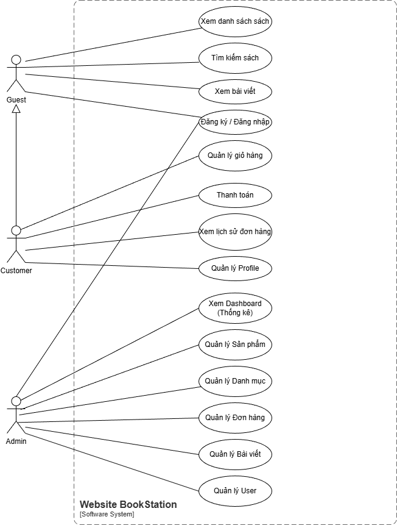
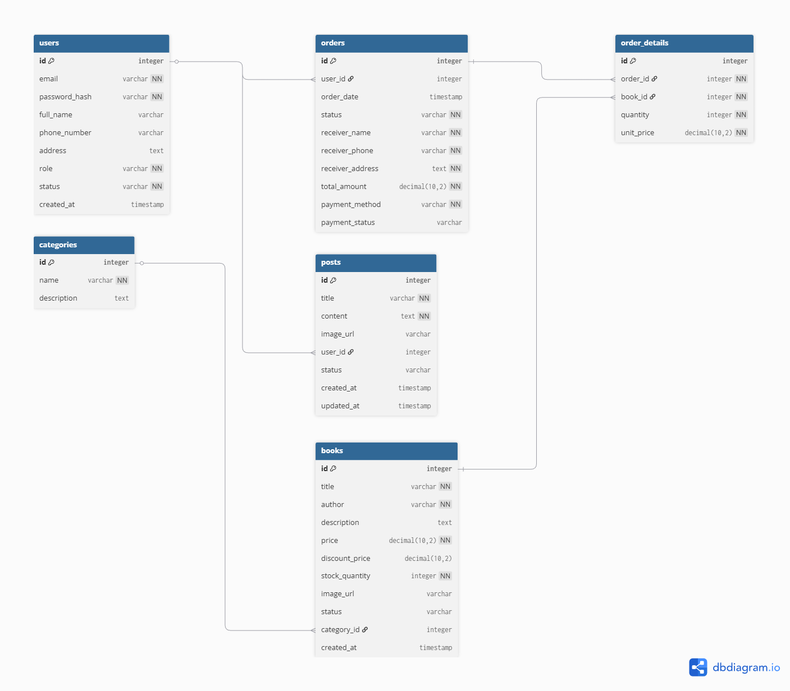

# SOFTWARE REQUIREMENTS SPECIFICATION (SRS)
**Project:** BookStation - Online Bookstore
**Version:** 1.0

## 1. GIỚI THIỆU (INTRODUCTION)
### 1.1 Mục đích
Tài liệu này mô tả chi tiết các yêu cầu chức năng và phi chức năng cho hệ thống website bán sách BookStation. Hệ thống được xây dựng theo mô hình Client-Server (Headless Architecture).

### 1.2 Phạm vi (Scope)
Hệ thống bao gồm:
- **Client (Frontend):** Website cho khách hàng và trang quản trị (Admin Dashboard).
- **Server (Backend):** RESTful API cung cấp dữ liệu và xử lý nghiệp vụ.

## 2. CÁC TÁC NHÂN (ACTORS)
- **Guest (Khách vãng lai):** Người dùng chưa đăng nhập.
- **Customer (Khách hàng):** Người dùng đã có tài khoản và đăng nhập.
- **Administrator (Quản trị viên):** Người quản lý vận hành hệ thống.

## 3. SƠ ĐỒ USE CASE (USE CASE DIAGRAM)

## 4. YÊU CẦU CHỨC NĂNG (FUNCTIONAL REQUIREMENTS)

### 4.1 Phân hệ Public (Guest)
| ID | Tên chức năng | Mô tả chi tiết |
|---|---|---|
| **F-PUB-01** | Xem danh sách sách | Hiển thị sách mới, sách bán chạy, sách giảm giá (dựa trên `DiscountPrice`). Hỗ trợ phân trang. |
| **F-PUB-02** | Tìm kiếm & Lọc | Tìm theo tên/tác giả. Lọc theo danh mục, khoảng giá. Sắp xếp (A-Z, Giá tăng/giảm). |
| **F-PUB-03** | Xem chi tiết sách | Hiển thị: Tên, Giá, Giá giảm, Mô tả, Ảnh, Tồn kho, Trạng thái. |
| **F-PUB-04** | Xem bài viết | Xem danh sách và chi tiết tin tức/blog. |

### 4.2 Phân hệ Khách hàng (Customer)
| ID | Tên chức năng | Mô tả chi tiết |
|---|---|---|
| **F-CUS-01** | Quản lý giỏ hàng | Thêm/Sửa số lượng/Xóa sản phẩm. Tính tổng tiền tạm tính. |
| **F-CUS-02** | Thanh toán | Nhập thông tin giao hàng -> Chọn phương thức (COD/Chuyển khoản) -> Tạo đơn hàng. |
| **F-CUS-03** | Quản lý đơn hàng | Xem lịch sử đơn. Trạng thái: *Chờ xác nhận, Đang giao, Hoàn thành, Đã hủy*. |
| **F-CUS-04** | Profile | Cập nhật thông tin cá nhân. |

### 4.3 Phân hệ Quản trị (Admin)
| ID | Tên chức năng | Mô tả chi tiết |
|---|---|---|
| **F-ADM-01** | Dashboard | Biểu đồ doanh thu ngày/tháng. Thống kê tổng quan. |
| **F-ADM-02** | Quản lý Sản phẩm | CRUD Sách. Fields: Tên, Mô tả, Giá gốc, Giá giảm, Ảnh, Số lượng, Trạng thái (Ẩn/Hiện). |
| **F-ADM-03** | Quản lý Danh mục | CRUD Danh mục (1 cấp). |
| **F-ADM-04** | Quản lý Đơn hàng | Xem chi tiết. Cập nhật trạng thái (Duyệt/Giao/Hủy). |
| **F-ADM-05** | Quản lý Bài viết | CRUD tin tức (Tiêu đề, Nội dung, Hình ảnh). |
| **F-ADM-06** | Quản lý User | Xem danh sách người dùng hệ thống. |

## 5. YÊU CẦU PHI CHỨC NĂNG (NON-FUNCTIONAL REQUIREMENTS)
- **Hiệu năng:** API phản hồi < 500ms. Hình ảnh được tối ưu hóa.
- **Bảo mật:** Password Hash (BCrypt). API Authentication (JWT).
- **Database:** PostgreSQL (Dockerized). Dữ liệu tiền tệ dùng kiểu `Decimal`.
- **UI/UX:** Responsive trên Mobile/Desktop.

## 6. THIẾT KẾ CƠ SỞ DỮ LIỆU (ERD)
Hệ thống bao gồm 6 bảng thực thể chính: Users, Books, Categories, Orders, OrderDetails, Posts.

